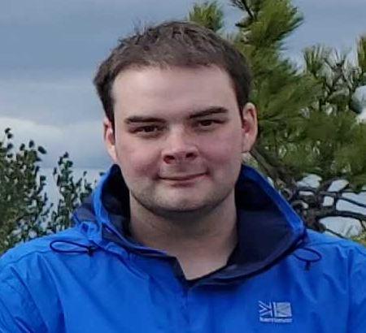

  

    <nav>
      <a href="/index" class="nav-link">About Me</a>
      <a href="/research" class="nav-link">Research</a>
    </nav>
  

  

    
    

      <strong>c.kimballrhines001 at umb dot edu</strong>
      <a href="https://linkedin.com/in/cmkr" target="_blank">linkedIn</a>

      <a href="https://github.com/coopermkr" target="_blank">github</a>

      <a href="/cv.pdf" download>Download CV</a>
    
 
  

  

    <h1>About Me</h1>
    

	My research focuses on applying genomic techniques to inform conservation policy and practice. I mainly work with ecosystem managers to identify and answer questions about population structure, genetic diversity, and inbreeding in plants that form the foundation of their restoration projects. I work with short reads, long reads, DNA, RNA, and methylation to give managers the best recommendations I can. 
    

    

	When not in the lab, I am easily distracted by butterflies and will often interrupt myself to point one out if I know the species.
    

  

