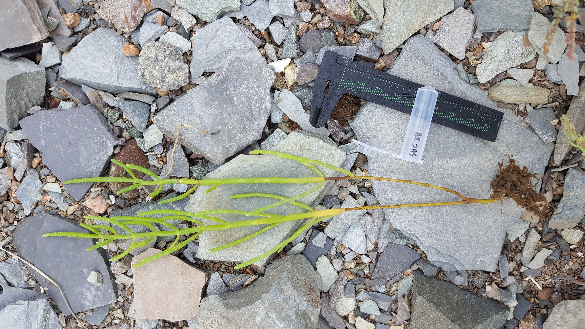

<nav style="text-align: right; margin-top: 0;">
  <a href="/index" style="margin-right: 1rem;">About Me</a>
  <a href="/research">Research</a>
</nav>

<!-- Lightbox modal -->

  

  

    
    
    
  

  

    

    <h2>Project 1</h2>
    

	My research focuses on applying genomic techniques to inform conservation policy and practice. I mainly work with ecosystem managers to identify and answer questions about population structure, genetic diversity, and inbreeding in plants that form the foundation of their restoration projects. I work with short reads, long reads, DNA, RNA, and methylation to give managers the best recommendations I can. 
    

    

	When not in the lab, I am easily distracted by butterflies and will often interrupt myself to point one out if I know the species.
    

  

  

    <h2>Project 2</h2>
    

	My research focuses on applying genomic techniques to inform conservation policy and practice. I mainly work with ecosystem managers to identify and answer questions about population structure, genetic diversity, and inbreeding in plants that form the foundation of their restoration projects. I work with short reads, long reads, DNA, RNA, and methylation to give managers the best recommendations I can. 
    

    

	When not in the lab, I am easily distracted by butterflies and will often interrupt myself to point one out if I know the species.
    

  

  

    <h2>Project 3</h2>
    

	My research focuses on applying genomic techniques to inform conservation policy and practice. I mainly work with ecosystem managers to identify and answer questions about population structure, genetic diversity, and inbreeding in plants that form the foundation of their restoration projects. I work with short reads, long reads, DNA, RNA, and methylation to give managers the best recommendations I can. 
    

    

	When not in the lab, I am easily distracted by butterflies and will often interrupt myself to point one out if I know the species.
    

  

