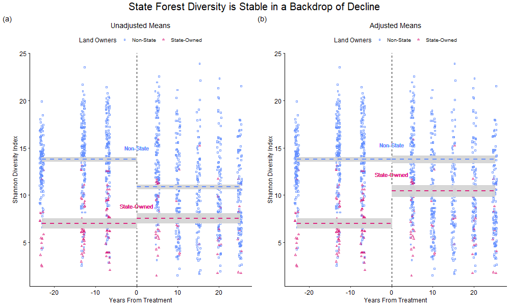

<nav style="text-align: right; margin-top: 0;">
  <a href="/index" style="margin-right: 1rem;">About Me</a>
  <a href="/research">Research</a>
</nav>

<h1>Research</h1>

<!-- Lightbox Modal -->

  

<!-- Project 1 -->

  

    
  

  

    <h2>Methylation</h2>
    

      Description of Project 1. You can include collaborators, goals, methods, and key findings.
    

  

<!-- Project 2 -->

  

    
  

  

    <h2>Genome Assembly</h2>
    

      Description of Project 2. Fieldwork, lab work, modeling, and interesting outcomes can go here.
    

  

<!-- Project 3 -->

  

    
  

  

    <h2>Policy Analysis</h2>
    

      Description of Project 3. Highlight significance, contributions, or links to publications.
    

  

